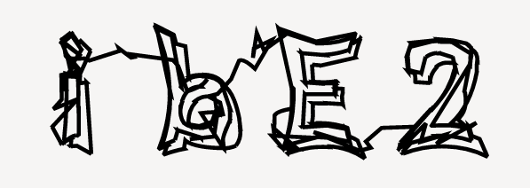
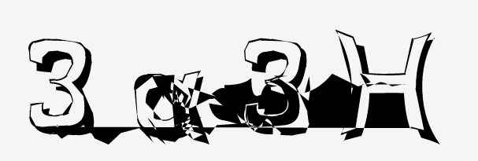
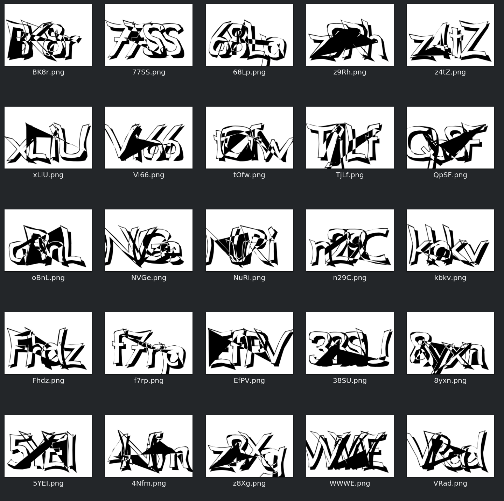

# ppfun-captcha

[](https://www.npmjs.com/package/ppfun-captcha)

Generate single-path svg captcha in node.js

## sample image

default captcha image:



with using fill instead of stroke:



galary of generated captchas (bulk converted to png to display):




## Origin

Credits go to the original author [produck](https://github.com/produck).
This is a fork with added features and fixes for [svg-captcha](https://github.com/produck/svg-captcha) which didn't merge important [Bugfixes](https://github.com/produck/svg-captcha/pull/47) and is at the current published state [cracked](https://github.com/produck/svg-captcha/issues/45).
If you want the original svg-capcha, check out [svg-captcha-fixed](https://www.npmjs.com/package/svg-captcha-fixed).

## useful if you

- cannot or do not want to use google recaptcha
- have issue with install c++ addon

## install

```
npm install ppfun-captcha
```

## usage

```Javascript
var svgCaptcha = require('ppfun-captcha');

var captcha = svgCaptcha.create();
console.log(captcha);
// {data: '<svg.../svg>', text: 'abcd'}
```

with express

```Javascript
var svgCaptcha = require('svg-captcha');

app.get('/captcha', function (req, res) {
	var captcha = svgCaptcha.create();
	req.session.captcha = captcha.text;
	
	res.type('svg');
	res.status(200).send(captcha.data);
});
```

## API

#### `svgCaptcha.create(options)`  
If no option is passed, you will get a random string of four characters and corresponding svg.  
  
* `size`: 4 // size of random string  
* `ignoreChars`: '0o1i' // filter out some characters like 0o1i  
* `background`: '#cc9966' // background color of the svg image  
* `stroke`: 'black' // style/color of the svg path stroke
* `fill`: 'black' // style/color of the svg strokes fill  
*  style: '' // svg path style attribute, i.e.: 'stroke-width: 4;'

Options that change the variation of the path:

* `nodeDeviation: 0.1
* `truncateLineProbability`: 0.5 
* `truncateCurveProbability`: 0.5
* `truncateCurvePositionMin`: 0.4
* `truncateCurvePositionMax`: 0.6
* `connectionPathDeviation` : 10.0

(when using fill, set connectionPathDeviation far lower as it covers parts of the paths and is harder for humans to read - and consider converting it [to PNG](https://morioh.com/p/2a17965187b6) before serving, to stop bots from being able to read those obstructed paths)

This function returns an object that has the following property:
* `data`: string // svg path data
* `text`: string // captcha text

#### `svgCaptcha.createMathExpr(options)`  
Similar to create api, you have the above options plus 3 additional:
* `mathMin`: 1 // the minimum value the math expression can be
* `mathMax`: 9 // the maximum value the math expression can be
* `mathOperator`: + // The operator to use, `+`, `-` or `+-` (for random `+` or `-`)

This function returns an object that has the following property:
* `data`: string // svg of the math expression
* `text`: string // the answer of the math expression

#### `svgCaptcha.loadFont(url)`
Load your own font and override the default font.
* `url`: string // path to your font
This api is a wrapper around loadFont api of opentype.js.  
Your may need experiment around various options to make your own font accessible.  
See the following api.

#### `svgCaptcha.options`
Gain access to global setting object. 
It is used for create and createMathExpr api as the default options.  
  
In addition to size, color, and background, you can also set the following property:
* `width`: number // width of captcha
* `height`: number // height of captcha
* `fontSize`: number // captcha text size
* `charPreset`: string // random character preset

#### `svgCaptcha.randomText([size|options])`  
return a random string.
#### `svgCaptcha(text, options)`
return a svg captcha based on text provided.  

In pre 1.1.0 version you have to call these two functions,  
now you can call create() to save some key strokes ;).

## FAQ

### This has to be a joke. /\<text.+\>;.+\<\/text\>/g.test...

svg captcha uses opentype.js underneath, which means that there is no
'&lt;text&gt;1234&lt;/text&gt;'.  
You get
'&lt;path fill="#444" d="M104.83 19.74L107.85 19.74L112 33.56L116.13 19.74L119.15 19.74L113.48 36.85...'  
instead.  

### Why no noise line option?

Noise lines can be easily filtered by path length and we decided to rather join characters with random paths, in order to to make the whole svg one single continuous path, which has the same purpose.

### Why no colors?

Colors don't add any security and can be easily changed to black & white anyway. The color of the stroke and fill can be manually choosen if it is neccessary for custom styles.
  
## License

[MIT](LICENSE.md)
